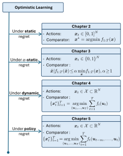

On **24 November 2025**, I successfully defended my Ph.D. dissertation,
*"Optimistic Learning with Applications to Caching Networks,"* at Delft University of Technology.

The work was carried out in the [Networked Systems Group](https://www.tudelft.nl/ewi/over-de-faculteit/afdelingen/software-technology/networked-systems),
under the supervision of **Prof. dr. K. G. Langendoen** (promotor) and **Dr. G. Iosifidis** (copromotor).

The thesis at a glance

The thesis asks how sequential decision-making algorithms can leverage untrusted predictions while still maintaining worst-case guarantees. Its central application is caching in content delivery networks, where the proposed algorithms are validated experimentally on multiple established datasets and benchmarks. Each chapter addresses this question under a progressively richer benchmark: static regret for coded caching, α-static regret for whole-file caching, dynamic regret for tracking a moving target, and policy regret for systems with memory.

<figure class="thesis-figure">
  
  <figcaption>Technical progression of the chapters. Each chapter adopts a distinct regret metric suited to its actions set and choice of comparator(s).</figcaption>
</figure>

## Materials

- **Dissertation (PDF):** [TU Delft Research Repository](https://pure.tudelft.nl/ws/portalfiles/portal/259515071/TUD_Dissertation_Naram.pdf) 📄 
- **Defense recording:** [TU Delft Mediasite](https://nmclive.tudelft.nl/mediasite/play/a8097c19d57e47488753f47123d2f2ec1d) 🎥 

## Doctoral Committee

- Rector Magnificus, *Chairman*
- **Prof. dr. K. G. Langendoen**, Delft University of Technology — *promotor*
- **Dr. G. Iosifidis**, Delft University of Technology — *copromotor*

### Independent Members

- **Prof. dr. G. Dán**, KTH Royal Institute of Technology, Sweden
- **Prof. dr. P. Grosso**, University of Amsterdam
- **Prof. dr. M. T. J. Spaan**, Delft University of Technology
- **Prof. dr. T. Spyropoulos**, Technical University of Crete, Greece
- **Dr. T. A. L. van Erven**, University of Amsterdam

I am deeply grateful to my promotors, the members of the committee, my colleagues, and my family
for their support throughout this journey.
