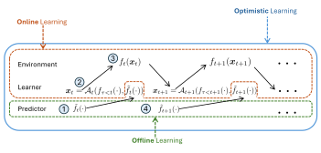

I develop algorithms that allocate resources before knowing future demands or operating conditions. I am interested in learning from this interaction, exploiting useful predictions, and providing rigorous guarantees when the environment behaves unexpectedly.

## Learning while the system runs

In online learning, an algorithm acts, observes feedback, and improves its next decisions. As Cesa-Bianchi notes in his foreword to [Orabona's book][orabona], learning and evaluation are interleaved, complementing the familiar separation between training and testing. Observations need not be independent samples from a fixed distribution.

The central performance measure is <dfn>regret</dfn>: the algorithm's accumulated cost relative to a benchmark, such as the best fixed decision in hindsight (for content delivery networks, the files that would have served users best). A suitable algorithm makes its average excess cost vanish over time without ever seeing future requests. This possibility is what draws me to the field.

Several mathematical frameworks capture this problem and form the basis of my work, from network slicing to UAV navigation and search:

- **Online convex optimization (OCO)** uses convex costs and feasible sets to design efficient algorithms for sequential decisions, from bandwidth allocation and portfolio selection to updating prediction models as data arrive; see [Orabona][orabona], [Hazan][hazan], and [Shalev-Shwartz][shalev].
- **Bandits** capture limited feedback: a recommendation system observes responses only to the items it displays, so learning must balance exploration and exploitation. Stochastic bandits assume stable reward distributions, while adversarial bandits do not; “adversarial” describes the guarantee's scope, not necessarily a malicious opponent. [Lattimore and Szepesvári][bandits] develop both settings.
- **Markov decision processes (MDPs) and control** incorporate lasting consequences: actions affect immediate rewards and future states, such as battery reserves. Learning in unknown MDPs connects exploration with long-term planning in reinforcement learning; see [Chapter 38 of Lattimore and Szepesvári][bandits]. Control theory captures the same interplay through system dynamics, and [Hazan and Singh][control] study it from an online learning perspective as non-stochastic control.

The broader systems perspective of these frameworks is considered in our [survey of pervasive AI](https://arxiv.org/abs/2105.01798), covering federated learning, distributed inference, and bandits under communication and computation constraints.

## Using predictions without trusting them

Now, consider a prediction of what happens next: a network operator might forecast demand with a machine learning model. Accurate forecasts could improve allocation, but their reliability may change precisely when good decisions matter most.

My [doctoral thesis][thesis] asks how algorithms can use **untrusted predictions while maintaining worst-case regret guarantees**: robust to inaccurate forecasts, yet gaining from informative ones. <dfn>Optimism</dfn> means adapting to prediction quality, which need not be known in advance.

<figure class="ri-figure">
  
  <figcaption>The protocol of optimistic learning: at each time slot, an untrusted prediction arrives (1); the learner acts on past costs, the prediction, and its accuracy so far (2); and the cost is realized (3) before the next prediction (4).</figcaption>
</figure>

Caching is a concrete starting point: choosing files before requests arrive can reduce delays and network traffic. Our [TMC paper](https://doi.org/10.1109/TMC.2023.3317943) develops optimistic algorithms for bipartite caching networks, where topology determines which caches serve each request, and learns which prediction sources are useful. Our [SIGMETRICS paper on discrete caching](https://arxiv.org/abs/2208.06414) establishes performance limits and algorithms for whole files and, more generally, the online Knapsack problem. The guarantees improve with prediction accuracy while preserving worst-case regret rates. Our monograph on optimistic learning for communication networks extends these ideas to routing and resource management.

The thesis then moves beyond a fixed benchmark: if demand changes, so can the best allocation. Through <dfn>dynamic regret</dfn>, I study performance against a moving sequence of decisions; our [ICML work on optimism with history pruning](https://arxiv.org/abs/2505.22899) develops a guarantee for this harder setting.

Finally, I study systems with memory through <dfn>non-stochastic control</dfn>. As in an MDP, actions affect future states, but the dynamics are linear, disturbances and convex costs may be adversarial, and we compete with the best **policy** in a specified class, chosen in hindsight. My thesis shows how forecasts over an extended horizon help account for the lasting effects of today's actions.

## When changing a decision has a cost

More recently, I have become interested in <dfn>smoothed online learning</dfn>, where an algorithm pays both for its decisions and for changing them. In mobile networks, [work on smooth handovers](https://ieeexplore.ieee.org/abstract/document/11044691) balances connectivity against handover costs; for AI inference, [recent work](https://arxiv.org/abs/2512.11131) applies smoothed online convex optimization to server/GPU provisioning with reconfiguration costs.

These examples motivate algorithms that balance responsiveness with stability; our [recent AISTATS paper](https://proceedings.mlr.press/v300/mhaisen26a.html) studies how much an algorithm can moderate its updates while tracking a changing benchmark.

## References for further reading

1. Francesco Orabona. [*Online Learning: A Modern Introduction Using Convex Optimization*][orabona]. 2026 manuscript.
2. Elad Hazan. [*Introduction to Online Convex Optimization*][hazan]. 2nd edition, MIT Press, 2022.
3. Tor Lattimore and Csaba Szepesvári. [*Bandit Algorithms*][bandits]. Cambridge University Press, 2020. Free online edition.
4. Naram Mhaisen. [*Optimistic Learning with Applications to Caching Networks*][thesis]. PhD thesis, TU Delft, 2025.

[orabona]: https://arxiv.org/abs/1912.13213v10
[hazan]: https://mitpress.mit.edu/9780262046985/introduction-to-online-convex-optimization/
[shalev]: https://doi.org/10.1561/2200000018
[bandits]: https://tor-lattimore.com/downloads/book/book.pdf
[thesis]: https://doi.org/10.4233/uuid:68fd39be-e3d5-4b3a-a3e5-76c80b3121f0
[control]: https://www.cambridge.org/core/books/introduction-to-online-control/4EAE3F32A195899D073E496D2EDBD730
